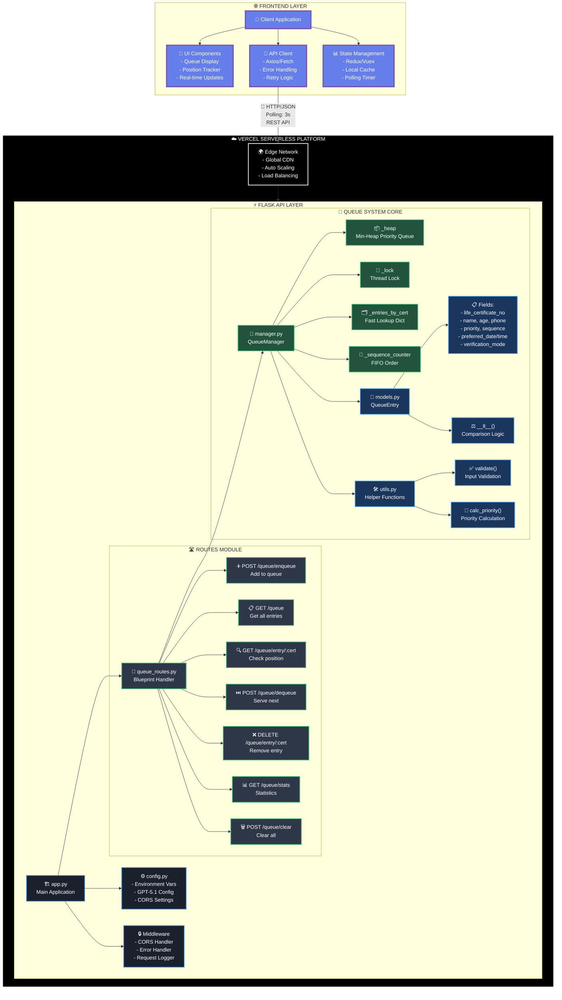
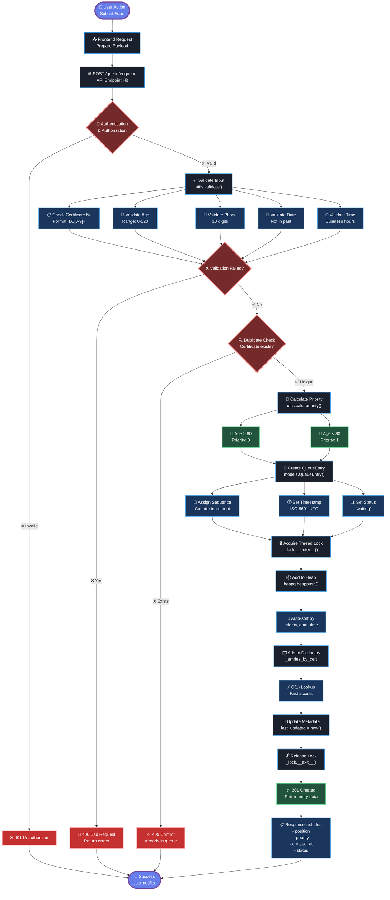
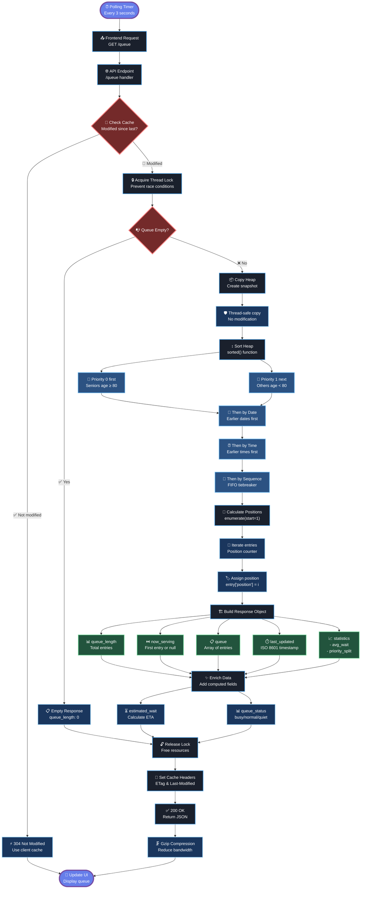
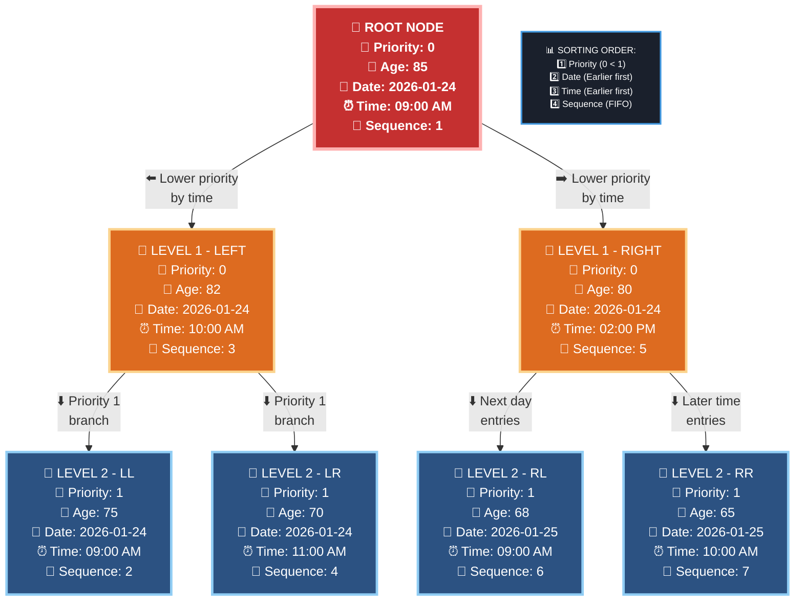
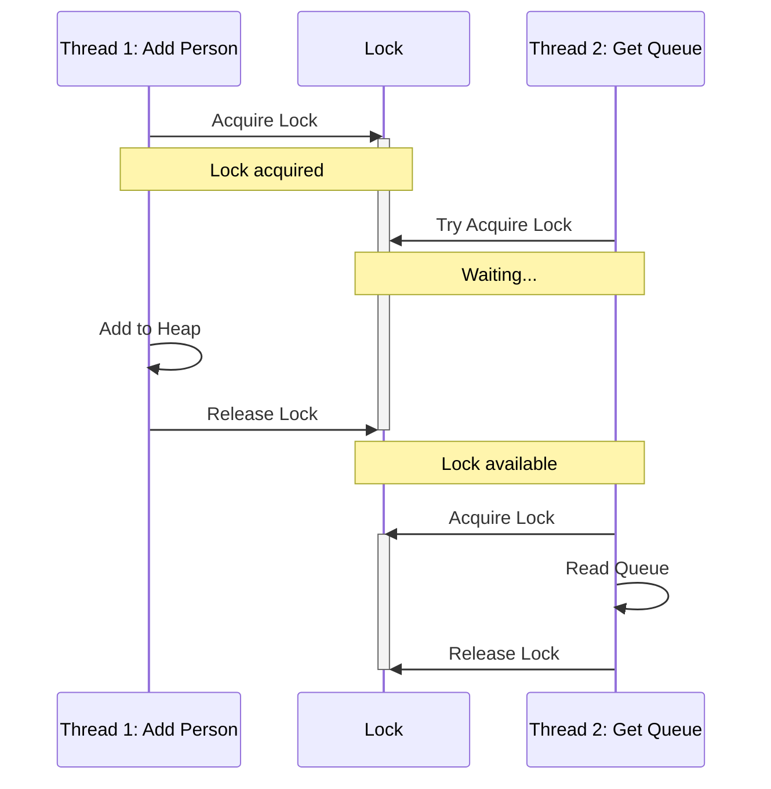
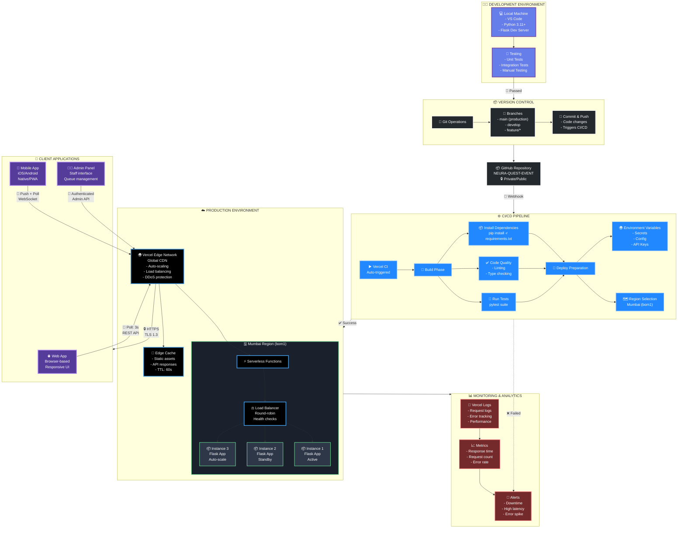

# Queue System Architecture

## System Architecture Diagram



## Data Flow

### Adding a Person to Queue



### Getting Queue State



### Serving Next Person

```mermaid
flowchart TD
    START(["👨‍💼 Staff Action<br/>Call Next Person"])
    REQ["📤 Frontend Request<br/>Serve button click"]
    
    API["🌐 POST /queue/dequeue<br/>Dequeue endpoint"]
    
    AUTH{"🔐 Staff Authorization<br/>Admin access?"}
    AUTH_FAIL["❌ 403 Forbidden<br/>Unauthorized"]
    
    LOCK["🔒 Acquire Thread Lock<br/>Critical section"]
    
    EMPTY{"📭 Queue Empty?<br/>Length == 0"}
    EMPTY_RESP["⚠️ 404 Not Found<br/>No one in queue"]
    EMPTY_LOG["📝 Log Event<br/>Empty dequeue attempt"]
    
    PEEK["👀 Peek First Entry<br/>Check priority"]
    PEEK_INFO["ℹ️ Entry Details:<br/>- Name<br/>- Certificate No<br/>- Priority<br/>- Wait time"]
    
    POP["⏭️ Pop from Heap<br/>heapq.heappop()"]
    POP_REORG["🔄 Heap Reorganize<br/>O(log n) operation"]
    POP_NEXT["📋 Next person bubbles up<br/>Auto-sorted"]
    
    REMOVE["🗑️ Remove from Dict<br/>_entries_by_cert"]
    REMOVE_KEY["🔑 Delete by cert_no<br/>O(1) operation"]
    
    HISTORY["📜 Add to History<br/>Served log"]
    HIST_TIME["⏱️ Service timestamp<br/>ISO 8601 UTC"]
    HIST_WAIT["⏳ Calculate wait time<br/>created_at vs now"]
    HIST_STAFF["👤 Staff ID<br/>Who served"]
    
    METRICS["📊 Update Metrics"]
    METRIC_COUNT["🔢 Total served<br/>Increment counter"]
    METRIC_AVG["⏰ Average wait<br/>Rolling average"]
    METRIC_PEAK["📈 Peak hours<br/>Time tracking"]
    
    UPDATE["🔄 Update Metadata<br/>last_updated = now()"]
    
    NOTIFY["📢 Send Notification?"]
    NOTIFY_SMS["📱 SMS Alert<br/>To person's phone"]
    NOTIFY_DISPLAY["📺 Display Board<br/>Show number"]
    NOTIFY_APP["🔔 Push Notification<br/>Mobile app alert"]
    
    UNLOCK["🔓 Release Lock<br/>Free resources"]
    
    BROADCAST["📡 Broadcast Update<br/>WebSocket event"]
    BROADCAST_ALL["🌐 Notify all clients<br/>Queue state changed"]
    
    RESPONSE["✅ 200 OK<br/>Return served person"]
    RESP_DATA["📋 Response includes:<br/>- Served person data<br/>- Next in queue<br/>- Updated queue length<br/>- Service timestamp"]
    
    LOG["📝 Audit Log<br/>Record transaction"]
    LOG_DB["💾 Persist to DB<br/>Compliance record"]
    
    END(["🎉 Person Served<br/>Next in line ready"])
    
    START --> REQ
    REQ --> API
    API --> AUTH
    
    AUTH -->|"✅ Authorized"| LOCK
    AUTH -->|"❌ Unauthorized"| AUTH_FAIL
    AUTH_FAIL --> END
    
    LOCK --> EMPTY
    
    EMPTY -->|"✅ Yes"| EMPTY_RESP
    EMPTY -->|"❌ No"| PEEK
    
    EMPTY_RESP --> EMPTY_LOG
    EMPTY_LOG --> UNLOCK
    
    PEEK --> PEEK_INFO
    PEEK_INFO --> POP
    
    POP --> POP_REORG
    POP_REORG --> POP_NEXT
    POP_NEXT --> REMOVE
    
    REMOVE --> REMOVE_KEY
    REMOVE_KEY --> HISTORY
    
    HISTORY --> HIST_TIME
    HISTORY --> HIST_WAIT
    HISTORY --> HIST_STAFF
    
    HIST_TIME --> METRICS
    HIST_WAIT --> METRICS
    HIST_STAFF --> METRICS
    
    METRICS --> METRIC_COUNT
    METRICS --> METRIC_AVG
    METRICS --> METRIC_PEAK
    
    METRIC_COUNT --> UPDATE
    METRIC_AVG --> UPDATE
    METRIC_PEAK --> UPDATE
    
    UPDATE --> NOTIFY
    
    NOTIFY --> NOTIFY_SMS
    NOTIFY --> NOTIFY_DISPLAY
    NOTIFY --> NOTIFY_APP
    
    NOTIFY_SMS --> UNLOCK
    NOTIFY_DISPLAY --> UNLOCK
    NOTIFY_APP --> UNLOCK
    
    UNLOCK --> BROADCAST
    BROADCAST --> BROADCAST_ALL
    BROADCAST_ALL --> RESPONSE
    
    RESPONSE --> RESP_DATA
    RESP_DATA --> LOG
    LOG --> LOG_DB
    LOG_DB --> END
    
    classDef startStyle fill:#667eea,stroke:#764ba2,stroke-width:4px,color:#fff
    classDef processStyle fill:#1a202c,stroke:#4299e1,stroke-width:2px,color:#fff
    classDef decisionStyle fill:#742a2a,stroke:#fc8181,stroke-width:3px,color:#fff
    classDef errorStyle fill:#c53030,stroke:#feb2b2,stroke-width:2px,color:#fff
    classDef successStyle fill:#22543d,stroke:#68d391,stroke-width:2px,color:#fff
    classDef dataStyle fill:#1a365d,stroke:#63b3ed,stroke-width:2px,color:#fff
    classDef notifyStyle fill:#553c9a,stroke:#b794f4,stroke-width:2px,color:#fff
    
    class START,END startStyle
    class REQ,API,LOCK,PEEK,POP,REMOVE,HISTORY,METRICS,UPDATE,UNLOCK,BROADCAST,LOG processStyle
    class AUTH,EMPTY,NOTIFY decisionStyle
    class AUTH_FAIL,EMPTY_RESP,EMPTY_LOG errorStyle
    class RESPONSE successStyle
    class PEEK_INFO,POP_REORG,POP_NEXT,REMOVE_KEY,HIST_TIME,HIST_WAIT,HIST_STAFF,METRIC_COUNT,METRIC_AVG,METRIC_PEAK,RESP_DATA,LOG_DB,BROADCAST_ALL dataStyle
    class NOTIFY_SMS,NOTIFY_DISPLAY,NOTIFY_APP notifyStyle
```



## Priority Queue Mechanics

### Heap Structure



### Comparison Logic

```python
def __lt__(self, other):
    # Lower values = higher priority (served first)
    
    if self.priority != other.priority:
        return self.priority < other.priority  # 0 before 1
    
    if self.preferred_date != other.preferred_date:
        return self.preferred_date < other.preferred_date  # Earlier dates first
    
    if self.preferred_time != other.preferred_time:
        return self.preferred_time < other.preferred_time  # Earlier times first
    
    return self.sequence < other.sequence  # FIFO as tiebreaker
```

## Thread Safety

### Lock Mechanism



## Request/Response Flow

### Example: Add Person

```
REQUEST:
POST /queue/enqueue
Content-Type: application/json

{
  "life_certificate_no": "LC123456",
  "name": "John Doe",
  "age": 85,
  "phone": "9876543210",
  "proof_guardian_name": "Jane Doe",
  "verification_mode": "presence",
  "preferred_date": "2026-01-25",
  "preferred_time": "10:00"
}

RESPONSE (201):
{
  "success": true,
  "message": "Person added to queue successfully",
  "data": {
    "life_certificate_no": "LC123456",
    "name": "John Doe",
    "age": 85,
    "priority": 0,
    "status": "waiting",
    "created_at": "2026-01-24T10:30:45.123456Z"
  }
}
```

## Deployment Architecture



## Performance Characteristics

| Operation | Time Complexity | Thread Safe |
|-----------|----------------|-------------|
| enqueue() | O(log n) | ✅ Yes |
| dequeue() | O(log n) | ✅ Yes |
| get_queue_state() | O(n log n) | ✅ Yes |
| get_entry_by_cert() | O(n) | ✅ Yes |
| remove_entry_by_cert() | O(n) | ✅ Yes |

## Memory Usage

```
Per QueueEntry: ~200 bytes
1000 people: ~200 KB
10000 people: ~2 MB

Vercel Limits:
- Hobby: 1024 MB (can handle ~5M entries theoretically)
- Pro: 3009 MB (can handle ~15M entries theoretically)

Practical limit: ~50K-100K entries for optimal performance
```

## API Endpoints Summary

```
┌──────────┬─────────────────────────────┬──────────────────┐
│ Method   │ Endpoint                    │ Purpose          │
├──────────┼─────────────────────────────┼──────────────────┤
│ GET      │ /health                     │ Health check     │
│ POST     │ /queue/enqueue              │ Add person       │
│ GET      │ /queue                      │ Get full queue   │
│ GET      │ /queue/entry/{cert_no}      │ Check position   │
│ POST     │ /queue/dequeue              │ Serve next       │
│ DELETE   │ /queue/entry/{cert_no}      │ Remove person    │
│ GET      │ /queue/stats                │ Get statistics   │
│ POST     │ /queue/clear                │ Clear all        │
└──────────┴─────────────────────────────┴──────────────────┘
```

---

**This architecture provides:**
- ✅ Thread-safe operations
- ✅ O(log n) queue operations
- ✅ Real-time updates via polling
- ✅ Scalable serverless deployment
- ✅ Automatic HTTPS and CDN
- ✅ Global availability
